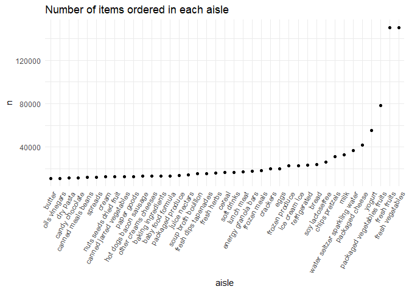
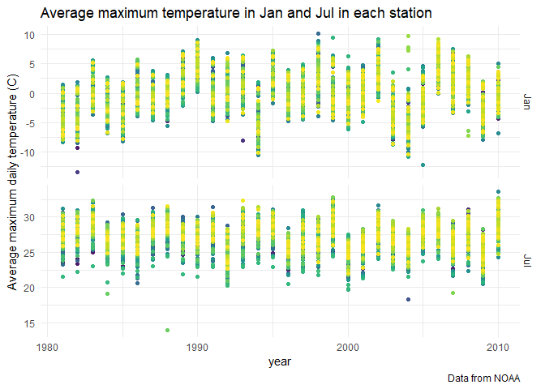
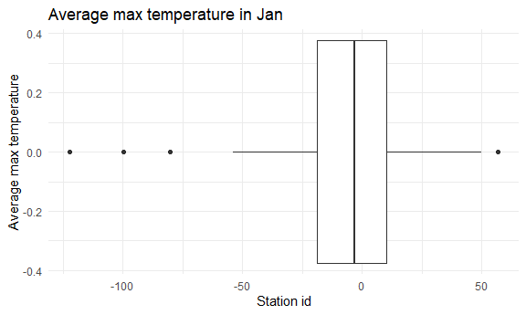
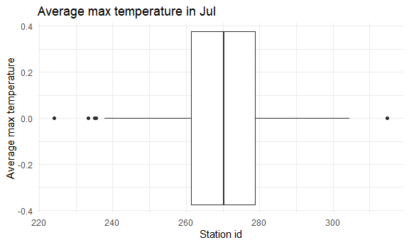
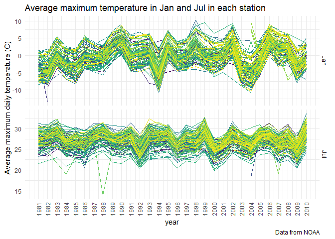
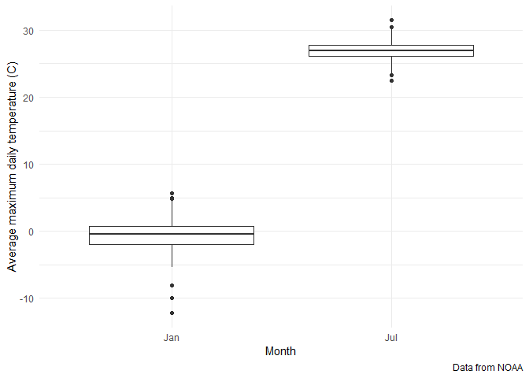
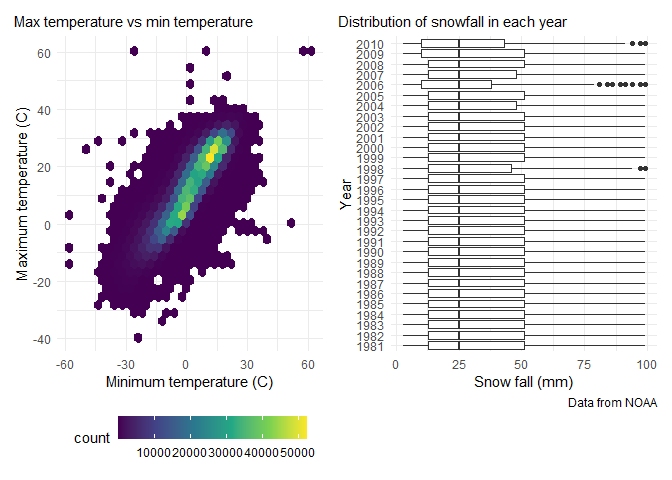

p8105_hw3_js6177
================
Jiayi Shi

## Problem 1

``` r
library(p8105.datasets)
data("instacart")

instacart = 
  instacart %>% 
  as_tibble(instacart)
```

his dataset contains 1384617 rows and 15 columns, with each row
resprenting a single product from an instacart order. Variables include
identifiers for user, order, and product; the order in which each
product was added to the cart. There are several order-level variables,
describing the day and time of the order, and number of days since prior
order. Then there are several item-specific variables, describing the
product name (e.g. Yogurt, Avocado), department (e.g. dairy and eggs,
produce), and aisle (e.g. yogurt, fresh fruits), and whether the item
has been ordered by this user in the past. In total, there are 39123
products found in 131209 orders from 131209 distinct users.

Below is a table summarizing the number of items ordered from aisle. In
total, there are 134 aisles, with fresh vegetables and fresh fruits
holding the most items ordered by far.

``` r
instacart %>% 
  count(aisle) %>% 
  arrange(desc(n))
```

    ## # A tibble: 134 × 2
    ##    aisle                              n
    ##    <chr>                          <int>
    ##  1 fresh vegetables              150609
    ##  2 fresh fruits                  150473
    ##  3 packaged vegetables fruits     78493
    ##  4 yogurt                         55240
    ##  5 packaged cheese                41699
    ##  6 water seltzer sparkling water  36617
    ##  7 milk                           32644
    ##  8 chips pretzels                 31269
    ##  9 soy lactosefree                26240
    ## 10 bread                          23635
    ## # … with 124 more rows

Next is a plot that shows the number of items ordered in each aisle.
Here, aisles are ordered by ascending number of items.

``` r
instacart %>% 
  count(aisle) %>% 
  filter(n > 10000) %>% 
  mutate(aisle = fct_reorder(aisle, n)) %>% 
  ggplot(aes(x = aisle, y = n)) + 
  geom_point() + 
  labs(title = "Number of items ordered in each aisle") +
  theme(axis.text.x = element_text(angle = 60, hjust = 1))
```

<!-- -->

Our next table shows the three most popular items in aisles
`baking ingredients`, `dog food care`, and `packaged vegetables fruits`,
and includes the number of times each item is ordered in your table.

``` r
instacart %>% 
  filter(aisle %in% c("baking ingredients", "dog food care", "packaged vegetables fruits")) %>%
  group_by(aisle) %>% 
  count(product_name) %>% 
  mutate(rank = min_rank(desc(n))) %>% 
  filter(rank < 4) %>% 
  arrange(desc(n)) %>%
  knitr::kable()
```

| aisle                      | product_name                                  |    n | rank |
|:---------------------------|:----------------------------------------------|-----:|-----:|
| packaged vegetables fruits | Organic Baby Spinach                          | 9784 |    1 |
| packaged vegetables fruits | Organic Raspberries                           | 5546 |    2 |
| packaged vegetables fruits | Organic Blueberries                           | 4966 |    3 |
| baking ingredients         | Light Brown Sugar                             |  499 |    1 |
| baking ingredients         | Pure Baking Soda                              |  387 |    2 |
| baking ingredients         | Cane Sugar                                    |  336 |    3 |
| dog food care              | Snack Sticks Chicken & Rice Recipe Dog Treats |   30 |    1 |
| dog food care              | Organix Chicken & Brown Rice Recipe           |   28 |    2 |
| dog food care              | Small Dog Biscuits                            |   26 |    3 |

Finally is a table showing the mean hour of the day at which Pink Lady
Apples and Coffee Ice Cream are ordered on each day of the week. This
table has been formatted in an untidy manner for human readers. Pink
Lady Apples are generally purchased slightly earlier in the day than
Coffee Ice Cream, with the exception of day 5.

``` r
instacart %>%
  filter(product_name %in% c("Pink Lady Apples", "Coffee Ice Cream")) %>%
  group_by(product_name, order_dow) %>%
  summarize(mean_hour = mean(order_hour_of_day)) %>%
  #spread(key = order_dow, value = mean_hour) %>%
  pivot_wider(
    names_from = "order_dow",
    values_from = "mean_hour"
  ) %>% 
  knitr::kable(digits = 2)
```

    ## `summarise()` has grouped output by 'product_name'. You can override using the
    ## `.groups` argument.

| product_name     |     0 |     1 |     2 |     3 |     4 |     5 |     6 |
|:-----------------|------:|------:|------:|------:|------:|------:|------:|
| Coffee Ice Cream | 13.77 | 14.32 | 15.38 | 15.32 | 15.22 | 12.26 | 13.83 |
| Pink Lady Apples | 13.44 | 11.36 | 11.70 | 14.25 | 11.55 | 12.78 | 11.94 |

## Problem 2

### tidy data

The code below reads the data, cleans the variables’ names, create a
variable `day_type` that specifies weekday or weekend of the associated
day, convert `day_type` and `day` into factor variables. I then pivot
the dataset form wide to long, transforming all of those 1,440 columns
into just two columns: `activity_num` and `activity_count`. I then
arrange the columns to produce the final dataset.

``` r
accel = read_csv("data/accel_data.csv") %>% 
  janitor::clean_names() %>% 
  mutate(
    day_type = ifelse(day %in% c("Sunday","Saturday"),"weekend","weekday"),
    day_type = as.factor(day_type),
    day = as.factor(day)
  ) %>% 
  pivot_longer(
    activity_1:activity_1440,
    names_to = "activity_num",
    names_prefix = "activity_",
    values_to = "activity_count"
  ) %>% 
  select(week,day_id,day,day_type,everything())
```

    ## Rows: 35 Columns: 1443
    ## ── Column specification ────────────────────────────────────────────────────────
    ## Delimiter: ","
    ## chr    (1): day
    ## dbl (1442): week, day_id, activity.1, activity.2, activity.3, activity.4, ac...
    ## 
    ## ℹ Use `spec()` to retrieve the full column specification for this data.
    ## ℹ Specify the column types or set `show_col_types = FALSE` to quiet this message.

The resulting dataset has 50400 observations and 6 variables. Each row
shows activity counts for each minute of a specific day. Variables
including `week` (week number), `day_id` (day identifier), a factor
variable `day` (Mon-Sun), a factor variable `day_type` (weekday vs
weekend), `activity_num` which is the minute of the day ranging from 1
to 1440, `activity_count` the activity count of that minute on the
associated day.

### total activity

The code belows create a variable `total_activity` by summing up the
activity counts for each minute of the associated day.

``` r
accel %>% 
  group_by(day_id) %>% 
  summarise(total_activity = sum(activity_count)) %>%
  knitr::kable(col.names = c("Day id","Total activity counts"),digit = 1)
```

| Day id | Total activity counts |
|-------:|----------------------:|
|      1 |              480542.6 |
|      2 |               78828.1 |
|      3 |              376254.0 |
|      4 |              631105.0 |
|      5 |              355923.6 |
|      6 |              307094.2 |
|      7 |              340115.0 |
|      8 |              568839.0 |
|      9 |              295431.0 |
|     10 |              607175.0 |
|     11 |              422018.0 |
|     12 |              474048.0 |
|     13 |              423245.0 |
|     14 |              440962.0 |
|     15 |              467420.0 |
|     16 |              685910.0 |
|     17 |              382928.0 |
|     18 |              467052.0 |
|     19 |              371230.0 |
|     20 |              381507.0 |
|     21 |              468869.0 |
|     22 |              154049.0 |
|     23 |              409450.0 |
|     24 |                1440.0 |
|     25 |              260617.0 |
|     26 |              340291.0 |
|     27 |              319568.0 |
|     28 |              434460.0 |
|     29 |              620860.0 |
|     30 |              389080.0 |
|     31 |                1440.0 |
|     32 |              138421.0 |
|     33 |              549658.0 |
|     34 |              367824.0 |
|     35 |              445366.0 |

From the table, I cannot see any apparent trend.

The table below shows the number of day and the total activity counts
for the associated day, which is orded by the total activity counts.

``` r
accel %>% 
  group_by(day) %>% 
  summarise(day_count = n()/1440,
            total_activity = sum(activity_count)) %>% 
  arrange(desc(total_activity)) %>% 
  knitr::kable()
```

| day       | day_count | total_activity |
|:----------|----------:|---------------:|
| Friday    |         5 |        2291711 |
| Wednesday |         5 |        2129772 |
| Thursday  |         5 |        2091151 |
| Sunday    |         5 |        1919213 |
| Monday    |         5 |        1858699 |
| Tuesday   |         5 |        1799238 |
| Saturday  |         5 |        1369237 |

From this table, I can see that the activity counts fluctuate throughout
the week.

### Plot

The codes below convert the original dataset from wide to long, and
create a variable `hr_activity` which is the summation of the activity
counts for each minute within that hour. I then group dataset by `day`
and `activity_hr` and make a plot of 24-hour activity time courses of
each day of the week.

``` r
accel %>%  
  ggplot(aes(x = activity_num, y = activity_count, color = day)) +
  geom_point()+
  geom_line()+
  labs(
    title = "Plot of 24-hour activity time courses",
    x = "Time (minute)",
    y = "Activity counts"
  )+
  scale_color_discrete(name = "Day of the week")
```

<!-- -->

Since the plot is too messy, I convert the unit of x-axis from minute to
hour.

``` r
accel %>%  
  mutate(
    activity_num = as.integer(activity_num),
    activity_hr = activity_num %/% 60
  ) %>% 
  group_by(day,activity_hr) %>% 
  mutate(hr_count = sum(activity_count)) %>% 
  
  ggplot(aes(x = activity_hr, y = hr_count, color = day)) +
  geom_point()+
  geom_line()+
  labs(
    title = "Plot of 24-hour activity time courses",
    x = "Time (hour)",
    y = "Activity counts"
  )+
  scale_color_discrete(name = "Day of the week")
```

<!-- -->

From the plot, we can see that most activity happened between
6:00-22:00. On Monday and Friday night (20:00-21:00) as well as Saturday
morning (9:00-11:00) we see spikes in activity counts. Activity is very
low on Sunday. I then group dataset by `day_type` and the graph below
clearly shows that the mean activity count of weekend is lower than that
of weekday.

``` r
accel %>%  
  mutate(
    activity_num = as.integer(activity_num),
    activity_hr = activity_num %/% 60
  ) %>% 
  group_by(day_type,activity_hr) %>% 
  mutate(hr_count = sum(activity_count),
         mean_hr_count = mean(hr_count)
         ) %>% 
  
  ggplot(aes(x = activity_hr, y = mean_hr_count, color = day_type)) +
  geom_point()+
  geom_line()+
  labs(
    title = "Plot of 24-hour activity time courses",
    x = "Time (hour)",
    y = "Mean activity counts"
  )+
  viridis::scale_color_viridis(
    name = "Day type",
    discrete = TRUE) 
```

<!-- -->

## Problem 3

### Description

``` r
library(p8105.datasets)
data("ny_noaa")
```

The size of the dataset is 2595176 x 7, with2595176 observations and 7
variables, including `id` (Weather station ID), `date` (Date of
observation), `prcp` (Precipitation (tenths of mm)), `snow` (Snowfall
(mm)), `snwd` (Snow depth (mm)), `tmax` (Maximum temperature (tenths of
degrees C)) and `tmin` (Minimum temperature (tenths of degrees C)).

The codes below shows the structure of the dataset.

``` r
str(ny_noaa)
```

    ## tibble [2,595,176 × 7] (S3: tbl_df/tbl/data.frame)
    ##  $ id  : chr [1:2595176] "US1NYAB0001" "US1NYAB0001" "US1NYAB0001" "US1NYAB0001" ...
    ##  $ date: Date[1:2595176], format: "2007-11-01" "2007-11-02" ...
    ##  $ prcp: int [1:2595176] NA NA NA NA NA NA NA NA NA NA ...
    ##  $ snow: int [1:2595176] NA NA NA NA NA NA NA NA NA NA ...
    ##  $ snwd: int [1:2595176] NA NA NA NA NA NA NA NA NA NA ...
    ##  $ tmax: chr [1:2595176] NA NA NA NA ...
    ##  $ tmin: chr [1:2595176] NA NA NA NA ...
    ##  - attr(*, "spec")=
    ##   .. cols(
    ##   ..   id = col_character(),
    ##   ..   date = col_date(format = ""),
    ##   ..   prcp = col_integer(),
    ##   ..   snow = col_integer(),
    ##   ..   snwd = col_integer(),
    ##   ..   tmax = col_character(),
    ##   ..   tmin = col_character()
    ##   .. )

`id`, `tmax`, `tmin` are character variables, `date` is date variable,
and `prcp`, `snow`, `snwd` are integer variables.

The proportion of missing values 0.06 for `prcp`, 0.15 for `snow`, 0.23
for `snwd`, 0.44 for `tmax`, 0.44 for `tmin`. Since most of them is
larger than 10%, I think the missing value will influence the
exploratory numeric analysis to some extent.

### (1)

The code belows do the data cleaning: separate `date` variable into
`year`, `month`, and `day`, convert`tmin` and `tmax` from character to
numeric variables, and ensure observations for temperature,
precipitation, and snowfall are given in reasonable units.

``` r
ny_noaa_tidy = 
  mutate(ny_noaa,
    year = as.integer(lubridate::year(date)), 
    month = as.integer(lubridate::month(date)), 
    day = as.integer(lubridate::day(date)),
    prcp = prcp/10,
    tmin = as.numeric(tmin)/10,
    tmax = as.numeric(tmax)/10
    ) %>% 
  select(id,date,year,month,day,prcp:tmin) 
  
ny_noaa_tidy %>% summarise(median_snow = median(snow, na.rm = T))
```

    ## # A tibble: 1 × 1
    ##   median_snow
    ##         <int>
    ## 1           0

The most commonly observed values for snowfall is 0 mm (using R inline
code to calculate median).

### (2)

I use `group_by` based on `id`, `year` and `month` to calculate the
average max temperature in January and July in each station
respectively, and make a two-panel Spaghetti plot to show the average
`tmax` across years.

``` r
ny_noaa_tidy %>% 
  mutate(month = month.abb[month]) %>% 
  filter(month %in% c("Jan","Jul")) %>% 
  group_by(id,year,month) %>% 
  mutate(avg_tmax = mean(tmax, na.rm = TRUE)) %>% 
  filter(!(is.na(avg_tmax))) %>% 
  
  ggplot(aes(x = year, y = avg_tmax, color = id))+
  geom_line() +
  facet_grid(month ~., scales = "free_y") +
  labs(
    title = "Average maximum temperature in Jan and Jul in each station",
    x = "year",
    y = "Average maximum daily temperature (C)",
    caption = "Data from NOAA")+
  scale_x_continuous(breaks = seq(1981,2010,1))+
  theme(axis.text.x = element_text(angle = 90, vjust = 0.5, hjust=1))+
  theme(legend.position = "none")
```

<!-- -->

From the plot, it seems that both the distributions are normal. The
average max temperature in January centers around -0.2C while that in
July centers around 27C. The max temperature of January varies more than
that of July.

I use boxplot to identify outliers.

``` r
ny_noaa_tidy %>% 
  mutate(month = month.abb[month]) %>% 
  filter(month %in% c("Jan","Jul")) %>% 
  group_by(id,month) %>% 
  mutate(avg_tmax = mean(tmax, na.rm = TRUE)) %>% 
  filter(!(is.na(avg_tmax))) %>% 
  ggplot(aes(x = month, y = avg_tmax))+
  geom_boxplot()+
  labs(y = "Average maximum daily temperature (C)",
    x = "Month",
    caption = "Data from NOAA")
```

<!-- -->

Therefore, I can find the outliers for average max temperature in
January and July respectively using the following code.

``` r
rbind(
  ny_noaa_tidy %>% 
  mutate(month = month.abb[month]) %>% 
  filter(month == "Jan") %>% 
  group_by(id) %>% 
  summarise(avg_tmax = mean(tmax, na.rm = TRUE)) %>% 
  filter(min_rank(avg_tmax)<4),
  ny_noaa_tidy %>% 
  mutate(month = month.abb[month]) %>% 
  filter(month == "Jan") %>% 
  group_by(id) %>% 
  summarise(avg_tmax = mean(tmax, na.rm = TRUE)) %>%
  filter(min_rank(desc(avg_tmax))<3))
```

    ## # A tibble: 5 × 2
    ##   id          avg_tmax
    ##   <chr>          <dbl>
    ## 1 USC00301723    -9.98
    ## 2 USC00302720    -8.02
    ## 3 USC00305925   -12.2 
    ## 4 USC00305380     5.67
    ## 5 USC00306138     4.99

``` r
rbind(
  ny_noaa_tidy %>% 
  mutate(month = month.abb[month]) %>% 
  filter(month == "Jul") %>% 
  group_by(id) %>% 
  summarise(avg_tmax = mean(tmax, na.rm = TRUE)) %>% 
  filter(min_rank(avg_tmax)<3),
  ny_noaa_tidy %>% 
  mutate(month = month.abb[month]) %>% 
  filter(month == "Jul") %>% 
  group_by(id) %>% 
  summarise(avg_tmax = mean(tmax, na.rm = TRUE)) %>%
  filter(min_rank(desc(avg_tmax))<3))
```

    ## # A tibble: 4 × 2
    ##   id          avg_tmax
    ##   <chr>          <dbl>
    ## 1 USC00305769     23.3
    ## 2 USC00307799     22.4
    ## 3 USC00305380     30.4
    ## 4 USC00305804     31.5

### (3)

To better reduce overlapping, I use hexagonal heatmap instead of
traditional scatterplot to plot `tmax` vs `tmin`. I use boxplot to show
the distribution of snowfall values greater than 0 and less than 100
separately by year.

``` r
tmax_tmin = 
  ny_noaa_tidy %>% 
  ggplot(aes(x = tmin, y = tmax))+
  geom_hex()+
    labs(
    title = "Max temperature vs min temperature",
    x = "Minimum temperature (C)",
    y = "Maximum temperature (C)"
  ) +
  theme(plot.title = element_text(size = 11),
        plot.title.position = "plot",
        legend.key.width = unit(1,"cm"))

snowfall = 
  ny_noaa_tidy %>%
  filter(snow>0,snow<100) %>%
  mutate(year = as.character(year)) %>% 
  ggplot(aes(x = snow, y = year)) + 
  geom_boxplot()+
  labs(
    title = "Distribution of snowfall in each year",
    y = "Year",
    x = "Snow fall (mm)",
    caption = "Data from NOAA"
  ) +
  #scale_y_discrete(breaks = c("1981", "1986", "1991", "1996", "2001", "2006", "2010"))+
  theme(plot.title = element_text(size = 11),
        plot.title.position = "plot",
        plot.caption.position = "panel")

#tmax_tmin / snowfall + plot_layout(ncol = 1, heights = c(1.5,2))
tmax_tmin + snowfall
```

<!-- -->

From the plot `tmax_tmin`, we can see that there are some outliers,
where extreme temperatures are reached. This may be because of wrong
records based on common sense. The maximum temperature centers around
14C while the minimum temperature centers around 3C.

The distributions of snowfall for all years are right-skewed, centering
around 20-30mm and median remains around 25mm.
