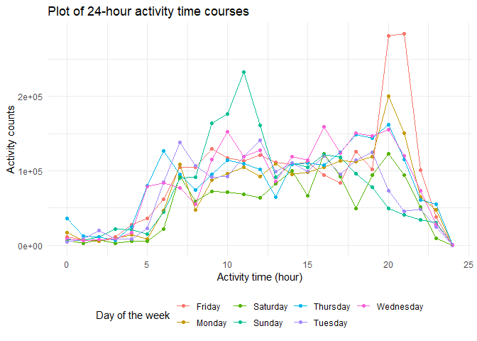
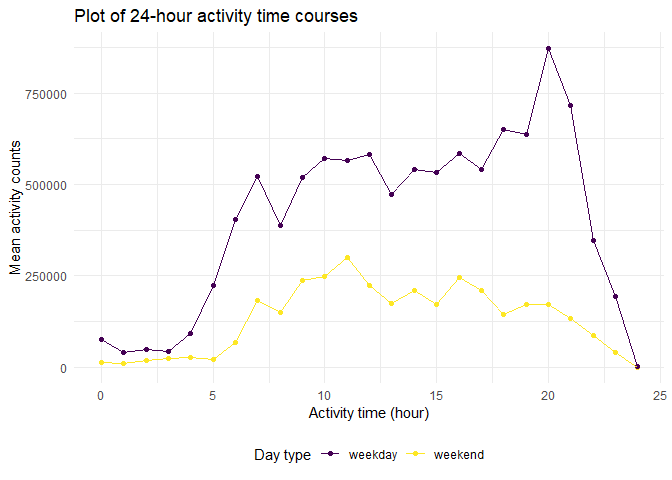
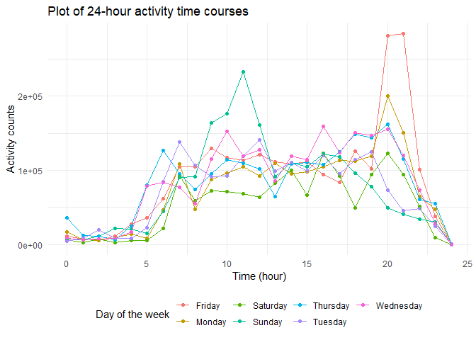

p8105_hw3_js6177
================
Jiayi Shi

## Problem 1

``` r
library(p8105.datasets)
data("instacart")
```

## Problem 2

### tidy data

The code below reads the data, cleans the variables’ names, create a
variable `day_type` that specifies weekday or weekend of the associated
day, convert `day` into a factor variable and arrange the columns to
produce the final dataset.

``` r
accel = read_csv("data/accel_data.csv") %>% 
  janitor::clean_names() %>% 
  mutate(
    day_type = ifelse(day %in% c("Sunday","Saturday"),"weekend","weekday"),
    day = as.factor(day)
  ) %>% 
  select(week,day_id,day,day_type,everything())
```

    ## Rows: 35 Columns: 1443
    ## ── Column specification ────────────────────────────────────────────────────────
    ## Delimiter: ","
    ## chr    (1): day
    ## dbl (1442): week, day_id, activity.1, activity.2, activity.3, activity.4, ac...
    ## 
    ## ℹ Use `spec()` to retrieve the full column specification for this data.
    ## ℹ Specify the column types or set `show_col_types = FALSE` to quiet this message.

The resulting dataset has 35 observations and 1444 variables, including
`week` (week number), `day_id` (day identifier), a factor variable `day`
(Mon-Sun), a character variable `day_type` (weekday vs weekend) and
`activity_*` (activity counts for each minute of a 24-hour day).

### total activity

The code belows create a variable `total_activity` by summing up the
activity counts for each minute of the associated day.

``` r
accel %>% 
  mutate(
    total_activity = select(.,starts_with("activity_")) %>% rowSums(na.rm = T)
         ) %>% 
  select(day_id,total_activity) %>% 
  knitr::kable(col.names = c("Day id","Total activity counts"))
```

| Day id | Total activity counts |
|-------:|----------------------:|
|      1 |             480542.62 |
|      2 |              78828.07 |
|      3 |             376254.00 |
|      4 |             631105.00 |
|      5 |             355923.64 |
|      6 |             307094.24 |
|      7 |             340115.01 |
|      8 |             568839.00 |
|      9 |             295431.00 |
|     10 |             607175.00 |
|     11 |             422018.00 |
|     12 |             474048.00 |
|     13 |             423245.00 |
|     14 |             440962.00 |
|     15 |             467420.00 |
|     16 |             685910.00 |
|     17 |             382928.00 |
|     18 |             467052.00 |
|     19 |             371230.00 |
|     20 |             381507.00 |
|     21 |             468869.00 |
|     22 |             154049.00 |
|     23 |             409450.00 |
|     24 |               1440.00 |
|     25 |             260617.00 |
|     26 |             340291.00 |
|     27 |             319568.00 |
|     28 |             434460.00 |
|     29 |             620860.00 |
|     30 |             389080.00 |
|     31 |               1440.00 |
|     32 |             138421.00 |
|     33 |             549658.00 |
|     34 |             367824.00 |
|     35 |             445366.00 |

From the table, I cannot see any apparent trend.

### Plot

The codes below convert the original dataset from wide to long, and
create a variable `hr_activity` which is the summation of the activity
counts for each minute within that hour. I then group dataset by `day`
and `activity_hr` and make a plot of 24-hour activity time courses of
each day of the week.

``` r
accel %>%  
  pivot_longer(
    activity_1:activity_1440,
    names_to = "activity_min",
    names_prefix = "activity_",
    values_to = "min_count"
  ) %>%  
  mutate(
    activity_min = as.integer(activity_min),
    activity_hr = activity_min %/% 60
  ) %>% 
  group_by(day,activity_hr) %>% 
  mutate(hr_count = sum(min_count)) %>% 
  
  ggplot(aes(x = activity_hr, y = hr_count, color = day)) +
  geom_point()+
  geom_line()+
  labs(
    title = "Plot of 24-hour activity time courses",
    x = "Activity time (hour)",
    y = "Activity counts"
  )+
  scale_color_discrete(name = "Day of the week")
```



Most activity happened between 6:00-22:00. On Monday and Friday night
(20:00-21:00) as well as Saturday morning (9:00-11:00) we see spikes in
activity counts. Activity is very low on Sunday. I then group dataset by
`day_type` and the graph below clearly shows that the mean activity
count of weekend is lower than that of weekday.

``` r
accel %>%  
  pivot_longer(
    activity_1:activity_1440,
    names_to = "activity_min",
    names_prefix = "activity_",
    values_to = "min_count"
  ) %>%  
  mutate(
    activity_min = as.integer(activity_min),
    activity_hr = activity_min %/% 60
  ) %>% 
  group_by(day_type,activity_hr) %>% 
  mutate(hr_count = sum(min_count),
         mean_hr_count = mean(hr_count)
         ) %>% 
  
  ggplot(aes(x = activity_hr, y = mean_hr_count, color = day_type)) +
  geom_point()+
  geom_line()+
  labs(
    title = "Plot of 24-hour activity time courses",
    x = "Activity time (hour)",
    y = "Mean activity counts"
  )
```



## Problem 3

### Description

``` r
library(p8105.datasets)
data("ny_noaa")
```

The size of the dataset is 2595176 x 7, with2595176 observations and 7
variables, including `id` (Weather station ID), `date` (Date of
observation), `prcp` (Precipitation (tenths of mm)), `snow` (Snowfall
(mm)), `snwd` (Snow depth (mm)), `tmax` (Maximum temperature (tenths of
degrees C)) and `tmin` (Minimum temperature (tenths of degrees C)). The
varibale classes are character, Date, integer, integer, integer,
character, character.

The codes below shows the structure of the dataset.

``` r
str(ny_noaa)
```

    ## tibble [2,595,176 × 7] (S3: tbl_df/tbl/data.frame)
    ##  $ id  : chr [1:2595176] "US1NYAB0001" "US1NYAB0001" "US1NYAB0001" "US1NYAB0001" ...
    ##  $ date: Date[1:2595176], format: "2007-11-01" "2007-11-02" ...
    ##  $ prcp: int [1:2595176] NA NA NA NA NA NA NA NA NA NA ...
    ##  $ snow: int [1:2595176] NA NA NA NA NA NA NA NA NA NA ...
    ##  $ snwd: int [1:2595176] NA NA NA NA NA NA NA NA NA NA ...
    ##  $ tmax: chr [1:2595176] NA NA NA NA ...
    ##  $ tmin: chr [1:2595176] NA NA NA NA ...
    ##  - attr(*, "spec")=
    ##   .. cols(
    ##   ..   id = col_character(),
    ##   ..   date = col_date(format = ""),
    ##   ..   prcp = col_integer(),
    ##   ..   snow = col_integer(),
    ##   ..   snwd = col_integer(),
    ##   ..   tmax = col_character(),
    ##   ..   tmin = col_character()
    ##   .. )

There are many missing values in columns `prcp:tmax`, which can cause
problems in numeric analysis.

### (1)

The code belows do the data cleaning: separate `date` variable into
`year`, `month`, and `day`, and convert`tmin` and `tmax` from character
to numeric variables.

``` r
ny_noaa_tidy = 
  mutate(ny_noaa,
    year = as.integer(lubridate::year(date)), 
    month = as.integer(lubridate::month(date)), 
    day = as.integer(lubridate::day(date)),
    tmin = as.numeric(tmin),
    tmax = as.numeric(tmax)
    ) %>% 
  select(id,date,year,month,day,prcp:tmin) 
  
ny_noaa_tidy %>% summarise(median_snow = median(snow, na.rm = T))
```

    ## # A tibble: 1 × 1
    ##   median_snow
    ##         <int>
    ## 1           0

The most commonly observed values for snowfall is 0 mm. This is because

### (2)

``` r
jan_data = 
ny_noaa_tidy %>% 
  mutate(month = month.abb[month]) %>% 
  filter(month == "Jan") %>% 
  group_by(id) %>% 
  summarise(avg_tmax = mean(tmax, na.rm = TRUE)) %>% 
  drop_na(avg_tmax)

jan_plot =  jan_data %>% 
  ggplot(aes(x = id, y = avg_tmax))+
  geom_point()

jul_data = 
  ny_noaa_tidy %>% 
  mutate(month = month.abb[month]) %>% 
  filter(month == "Jul") %>% 
  group_by(id) %>% 
  summarise(avg_tmax = mean(tmax, na.rm = TRUE))

jul_plot = jul_data %>% 
  drop_na(avg_tmax) %>% 
  ggplot(aes(x = id, y = avg_tmax))+
  geom_point()

jan_plot / jul_plot
```


The data points for both Jan and Jul seem to follow normal distribution.

I use boxplot to identify outliers.

``` r
jan_data %>% 
  ggplot(aes(x = avg_tmax))+geom_boxplot()+
  labs(
    title = "Average max temperature in Jan",
    x = "Station id",
    y = "Average max temperature"
  )
```



``` r
jul_data %>% 
  ggplot(aes(x = avg_tmax))+geom_boxplot()+
  labs(
    title = "Average max temperature in Jul",
    x = "Station id",
    y = "Average max temperature"
  )
```

    ## Warning: Removed 449 rows containing non-finite values (stat_boxplot).


Therefore, I can find the outliers for average max temperature in
January and July respectively using the following code.

``` r
rbind(jan_data %>% filter(min_rank(avg_tmax)<4),
      jan_data %>% filter(min_rank(desc(avg_tmax))<2))
```

    ## # A tibble: 4 × 2
    ##   id          avg_tmax
    ##   <chr>          <dbl>
    ## 1 USC00301723    -99.8
    ## 2 USC00302720    -80.2
    ## 3 USC00305925   -122  
    ## 4 USC00305380     56.7

``` r
rbind(jul_data %>% filter(min_rank(avg_tmax)<6),
      jul_data %>% filter(min_rank(desc(avg_tmax))<2))
```

    ## # A tibble: 6 × 2
    ##   id          avg_tmax
    ##   <chr>          <dbl>
    ## 1 USC00300424     235.
    ## 2 USC00304102     235.
    ## 3 USC00305769     233.
    ## 4 USC00307799     224.
    ## 5 USC00308248     235.
    ## 6 USC00305804     315.

### (3)

``` r
tmax_tmin = 
  ny_noaa_tidy %>% 
  pivot_longer(
    tmax:tmin,
    names_to = "observation",
    values_to = "temp"
  ) %>% 
ggplot(aes(x = temp, fill = observation))+
geom_density(alpha = .7)

snowfall = 
  ny_noaa_tidy %>% 
  group_by(year) %>% 
  filter(snow>0) %>% 
  ggplot(aes())
```
